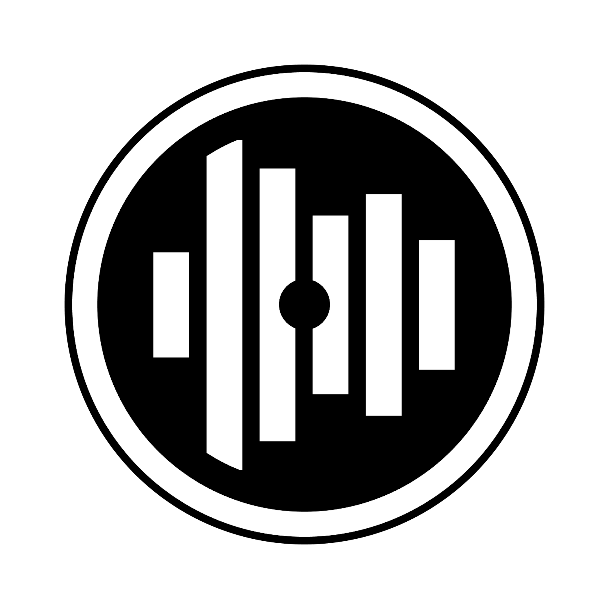

# Waxcode

A two-deck digital vinyl system for a Raspberry Pi 5. Two turntables with timecode records drive
two decks of digital audio; you control it from a browser on any device on your network. No laptop
at the gig, no subscription, no account.

It is free software. You can use it, change it, build boxes with it and sell them. See
[Licence](#licence).

## What you need

| | |
|---|---|
| Raspberry Pi 5 | 1GB is enough and is what this is tuned for |
| HiFiBerry DAC8x + ADC8x | or a pair of cheap USB audio interfaces, one per deck |
| Two turntables | with timecode records (Serato control vinyl is what this is calibrated against) |
| A mixer | any two-channel mixer with a record output |
| A USB stick | for your music |

Everything is 3.5mm stereo jacks on the HAT boards, so you will need adapters to reach a mixer.

## How it fits together

Timecode comes off the turntables into the ADC. `xwax` reads the needle position from it and plays
your files. The audio leaves on the DAC into your mixer. The mixer's record output goes back into
the box so it can record your set.

The Node server owns everything that is not audio: the library, waveforms, beat grids, the browser
UI, updates and the network setup. It talks to `xwax` over a local control socket, one per deck.

```
server/     the Node server - library, waveforms, beat grids, HTTP API
web/        the browser UI - React + TypeScript, builds into server/web/
pi/         provisioning: everything that turns a blank card into a box
updater/    the on-box updater, shipped and versioned separately from server/
qmtempo/    the beat-tracking helper the server spawns, built on Queen Mary's DSP
tools/      maintainer scripts - releases, design tokens, measurement rigs
```

The audio engine lives in a separate repository:
[waxcode-xwax](https://github.com/mhallrp/waxcode-xwax), a fork of
[xwax](https://github.com/xwax/xwax) by Mark Hills, carrying key lock, cue offsets, phono output
and some ARM64 fixes. You need it to build a box.

## Building a box

`pi/provision.sh` turns a fresh Raspberry Pi OS card into a working box. It builds the audio engine
from source, so clone the fork **alongside** this repository first:

```sh
git clone https://github.com/mhallrp/waxcode-main.git
git clone https://github.com/mhallrp/waxcode-xwax.git xwax
cd waxcode-main && sudo ./pi/provision.sh
```

It looks for the fork at `../xwax` by default; set `XWAX_SRC` if you keep it elsewhere. It will
refuse to build against upstream xwax, which lacks the additions the box depends on.

It installs the packages, builds `xwax` and `qmtempo` from source, installs the systemd units, the
udev rules and the sudoers fragments, and sets up the audio device tree. It is idempotent — running
it again is safe and is how you pick up changes.

`pi/build-card.sh` does the same thing over SSH to a card that is already booted, and verifies the
result. `pi/check-drift.sh` compares a running box against this repository and tells you what
differs; nothing should.

Once it is up, open `http://waxcodedvs.local` from anything on the same network. The server also
listens on 8080, which is the address to use if port 80 is unavailable to it.

## Developing

```sh
cd server && npm install && npm test    # 699 tests, no hardware needed
cd web    && npm install && npm run check   # types, design tokens, tests
cd web    && npm run build              # writes into ../server/web/
```

The box serves static files and never builds, so `server/web/` is committed. `npm run build` is
what updates it.

`web/scripts/deploy.sh <box-ip>` builds and copies the UI onto a running box.
`pi/deploy-to-box.sh` does the same for the server.

## Third-party code

| | |
|---|---|
| `qmtempo/qm-dsp/` | [Queen Mary DSP](https://github.com/c4dm/qm-dsp), GPL-2.0-or-later. Only the beat-tracking path is kept — see `qmtempo/qm-dsp/VENDORED.md`. |
| `qmtempo/qm-dsp/ext/kissfft/` | KissFFT, BSD-3-Clause. |
| the `xwax` fork | GPL-3.0-or-later, in its own repository. |

## Licence

GPL-3.0-or-later. See [LICENSE](LICENSE).

That means you may use, study, change, share and sell this software and anything built from it. The
one condition is that you pass on the same freedoms: if you distribute it, or a modified version,
the people you give it to get the source and the same rights.

GPL-3.0 is also what the `xwax` fork is under, so the whole system is one licence with no
exceptions to reason about. The vendored Queen Mary code is GPL-2.0-**or-later**, which is
compatible.
